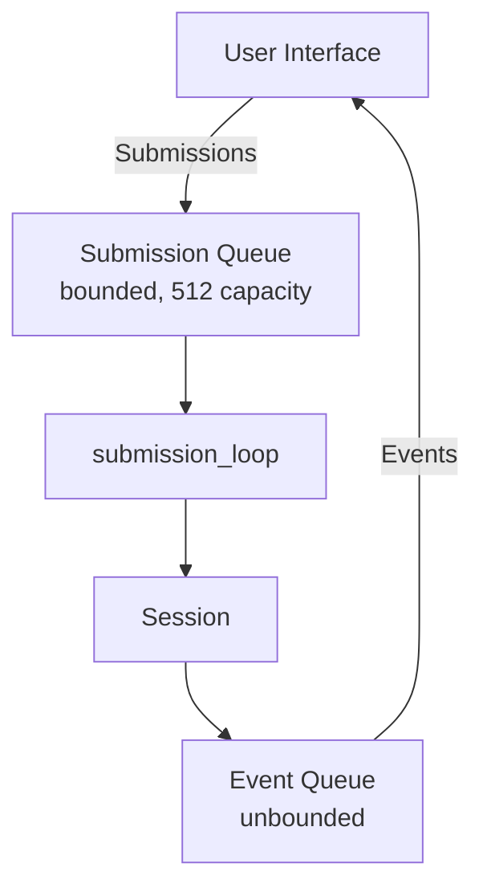
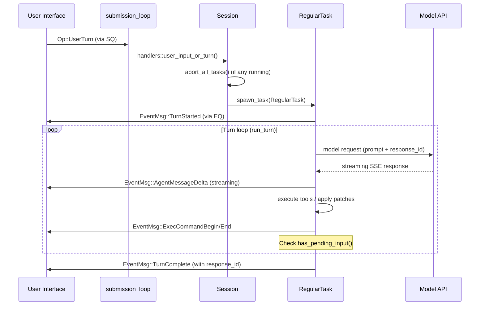

# Codex State Machine Architecture

The Codex state machine is a queue-based asynchronous system that manages conversation sessions through a hierarchical state model. This document describes the architecture as implemented in the Rust codebase.

## Core Architecture

The system follows a **queue-pair pattern** (SQ/EQ) with clear separation between user interface and agent logic:



**Text equivalent (for LLM/search consumption):**
```
Data flow (two independent channels):

  UI  ──submit(Op)──>  SQ (bounded, 512)  ──recv()──>  submission_loop  ──>  Session
  UI  <──next_event()──  EQ (unbounded)   <──send_event()──  Session

- SQ = Submission Queue: UI sends Op variants to the agent
- EQ = Event Queue: Agent sends EventMsg variants back to the UI
- submission_loop: sequential async loop processing one Op at a time
- Session: holds all state, services, and the active turn
```

### Key Components

1. **Codex** — The core engine exposing the public API (`/Users/gaxx/Github/copex/codex-rs/core/src/codex.rs:383-392`)
   - Manages the SQ/EQ channel pair
   - Provides `submit()` and `next_event()` methods
   - Tracks `AgentStatus` via a `watch` channel
   - Runs a background `submission_loop` on a spawned Tokio task
   - Holds an `Arc<Session>` shared with the submission loop

   ```rust
   pub struct Codex {
       pub(crate) tx_sub: Sender<Submission>,
       pub(crate) rx_event: Receiver<Event>,
       pub(crate) agent_status: watch::Receiver<AgentStatus>,
       pub(crate) session: Arc<Session>,
       pub(crate) session_loop_termination: SessionLoopTermination,
   }
   ```

2. **Session** — Holds configuration, services, and mutable state (`/Users/gaxx/Github/copex/codex-rs/core/src/state/session.rs`)
   - `SessionState` manages conversation history via `ContextManager`
   - Tracks rate limits, copilot quota, dependency env, granted permissions
   - Manages the `ActiveTurn` (the currently-running unit of work)
   - Coordinates session services (auth, models, MCP, plugins, skills, etc.)

   ```rust
   pub(crate) struct SessionState {
       pub(crate) session_configuration: SessionConfiguration,
       pub(crate) history: ContextManager,
       pub(crate) latest_rate_limits: Option<RateLimitSnapshot>,
       pub(crate) latest_copilot_quota: Option<Vec<CopilotQuota>>,
       pub(crate) server_reasoning_included: bool,
       pub(crate) dependency_env: HashMap<String, String>,
       pub(crate) mcp_dependency_prompted: HashSet<String>,
       previous_turn_settings: Option<PreviousTurnSettings>,
       pub(crate) startup_prewarm: Option<SessionStartupPrewarmHandle>,
       pub(crate) active_connector_selection: HashSet<String>,
       pub(crate) pending_session_start_source: Option<codex_hooks::SessionStartSource>,
       granted_permissions: Option<PermissionProfile>,
   }
   ```

3. **Task** — A unit of work executed in response to user input
   - Defined by the `SessionTask` trait (`/Users/gaxx/Github/copex/codex-rs/core/src/tasks/mod.rs:129`)
   - Concrete implementations: `RegularTask`, `ReviewTask`, `CompactTask`, `UndoTask`, `UserShellCommandTask`, `GhostSnapshotTask`
   - Each task runs on a background Tokio task with a `CancellationToken`
   - A Task consists of multiple Turns (iterations of the agentic loop)
   - `spawn_task()` calls `abort_all_tasks()` first, enforcing at most one regular task at a time

4. **Turn** — A single iteration cycle within a Task
   - Executed by the `run_turn()` function (`/Users/gaxx/Github/copex/codex-rs/core/src/codex.rs:5608`)
   - One cycle: model request -> response streaming -> tool execution -> output collection
   - Output from one Turn feeds as input to the next Turn
   - A Turn yielding no output terminates the Task
   - Can pause for approval requests (exec, patch, permissions)

### Task vs Turn: The Hierarchy

This is a key architectural distinction that the codebase uses inconsistently (see [Naming Inconsistencies](#naming-inconsistencies) below).

**Protocol v1 definition** (from `/Users/gaxx/Github/copex/codex-rs/docs/protocol_v1.md`):

| Concept | Definition | Code Mapping |
|---------|-----------|-------------|
| **Task** | The entire unit of work from one user input. Consists of a series of Turns. | `SessionTask` trait, `RunningTask` struct |
| **Turn** | One iteration cycle within a Task: model request -> stream response -> execute tools -> collect output. | `run_turn()` function |

The hierarchy is visible in `RegularTask::run()` (`/Users/gaxx/Github/copex/codex-rs/core/src/tasks/regular.rs:68-82`):

```rust
// Inside RegularTask::run()
loop {
    let last_agent_message = run_turn(
        Arc::clone(&sess),
        Arc::clone(&ctx),
        next_input,
        prewarmed_client_session.take(),
        cancellation_token.child_token(),
    ).await;
    if !sess.has_pending_input().await {
        return last_agent_message;
    }
    next_input = Vec::new();
}
```

A single Task loops through multiple `run_turn()` calls until there's no more pending input.

**Task completion conditions** (from protocol_v1.md):
- The model completes and there is no output to feed into an additional Turn
- New user input aborts the current Task and starts a new one
- UI sends `Op::Interrupt`
- Fatal errors (e.g., model connection exceeding retry limits)
- Blocked by user approval

### State Hierarchy (text representation)

```
Session (lifetime: entire session)
├── SessionState
│   ├── session_configuration    — immutable config snapshot
│   ├── history: ContextManager  — conversation history (what happened + what the agent knows)
│   ├── latest_rate_limits       — model rate limit tracking
│   ├── latest_copilot_quota     — copilot quota tracking
│   └── granted_permissions      — accumulated permission profile
│
└── ActiveTurn (lifetime: one task execution)
    ├── tasks: IndexMap<sub_id, RunningTask>   — one or more concurrent tasks
    │   ├── RunningTask (Regular)   ← owns CancellationToken, runs run_turn() loop
    │   ├── RunningTask (Review)    ← can coexist with Regular
    │   └── RunningTask (Compact)   ← can coexist with Regular
    │
    └── TurnState (shared across tasks in this ActiveTurn)
        ├── pending_approvals          — exec/patch approvals awaiting user response
        ├── pending_request_permissions — permission requests awaiting user response
        ├── pending_user_input         — tool input requests awaiting user response
        ├── token_usage_at_turn_start  — baseline for per-turn token accounting
        └── tool_calls                 — count of tool calls in this turn
```

### Container: ActiveTurn

The `ActiveTurn` struct (`/Users/gaxx/Github/copex/codex-rs/core/src/state/turn.rs:27-30`) is the container that tracks currently-running work:

```rust
pub(crate) struct ActiveTurn {
    pub(crate) tasks: IndexMap<String, RunningTask>,
    pub(crate) turn_state: Arc<Mutex<TurnState>>,
}
```

Despite its name, `ActiveTurn` maps to the **Task** concept — it holds one or more `RunningTask`s indexed by submission ID. The `TurnState` within it tracks pending approvals, token usage, and pending input for the duration of the Task.

`RunningTask` contains:
```rust
pub(crate) struct RunningTask {
    pub(crate) done: Arc<Notify>,
    pub(crate) kind: TaskKind,           // Regular, Review, or Compact
    pub(crate) task: Arc<dyn SessionTask>,
    pub(crate) cancellation_token: CancellationToken,
    pub(crate) handle: Arc<AbortOnDropHandle<()>>,
    pub(crate) turn_context: Arc<TurnContext>,
    pub(crate) _timer: Option<codex_otel::Timer>,
}
```

**Note on concurrency**: `spawn_task()` aborts all existing tasks before starting a new one, so only one regular Task runs at a time. However, `start_task()` (without abort) can be called separately for non-regular tasks (Review, Compact), meaning multiple `RunningTask`s can coexist within `ActiveTurn.tasks`.

## The Submission Loop

The heart of the state machine is `submission_loop` (`/Users/gaxx/Github/copex/codex-rs/core/src/codex.rs:4313`), which processes operations sequentially:

```rust
async fn submission_loop(sess: Arc<Session>, config: Arc<Config>, rx_sub: Receiver<Submission>) {
    while let Ok(sub) = rx_sub.recv().await {
        let should_exit = match sub.op.clone() {
            Op::Interrupt => { handlers::interrupt(&sess).await; false }
            Op::UserInput { .. } | Op::UserTurn { .. } => {
                handlers::user_input_or_turn(&sess, sub.id.clone(), sub.op).await;
                false
            }
            Op::ExecApproval { id, turn_id, decision } => {
                handlers::exec_approval(&sess, id, turn_id, decision).await;
                false
            }
            Op::Compact => { handlers::compact(&sess, sub.id.clone()).await; false }
            Op::Shutdown => handlers::shutdown(&sess, sub.id.clone()).await, // returns true
            // ... all other Op variants handled similarly ...
            _ => false,
        };
        if should_exit { break; }
    }
}
```

This ensures **state consistency** by processing operations one at a time. Each handler returns `false` to continue the loop, except `Op::Shutdown` which returns `true` to break.

## Communication Protocol

### Operations (Op) — User -> Codex

The `Op` enum (`/Users/gaxx/Github/copex/codex-rs/protocol/src/protocol.rs:212`) is `#[non_exhaustive]` and contains ~25+ variants:

**Core turn operations:**
- `UserTurn` — Start a new Task with full per-turn context (cwd, model, sandbox, approval policy, personality, etc.)
- `UserInput` — Legacy form of user input (prefer `UserTurn`)
- `Interrupt` — Abort current Task; emits `EventMsg::TurnAborted`
- `Shutdown` — Terminate the submission loop

**Approval/response operations:**
- `ExecApproval` — Approve/deny command execution
- `PatchApproval` — Approve/deny code patches
- `UserInputAnswer` — Respond to `request_user_input` tool calls
- `RequestPermissionsResponse` — Respond to permission requests
- `DynamicToolResponse` — Respond to dynamic tool calls
- `ResolveElicitation` — Resolve MCP elicitation requests

**Session management:**
- `OverrideTurnContext` — Update persistent turn defaults (cwd, model, sandbox, approval policy, personality, etc.)
- `Compact` — Summarize/compact conversation context
- `Undo` — Revert last turn
- `ThreadRollback` — Drop last N user turns from context
- `SetThreadName` — Set thread name in rollout metadata
- `ReloadUserConfig` — Reload config layer overrides

**Realtime conversation:**
- `RealtimeConversationStart` / `RealtimeConversationAudio` / `RealtimeConversationText` / `RealtimeConversationClose`

**Tools and resources:**
- `ListMcpTools` / `RefreshMcpServers` — MCP tool management
- `ListSkills` — Discover available skills
- `ListModels` — List available models
- `RunUserShellCommand` — Execute user-initiated `!cmd` shell commands

**Other:**
- `CleanBackgroundTerminals` — Terminate background terminal processes
- `InterAgentCommunication` — Inter-agent messaging
- `AddToHistory` / `GetHistoryEntryRequest` — History management
- `DropMemories` / `UpdateMemories` — Memory management
- `Review` — Request a code review from the agent

### Events (EventMsg) — Codex -> User

The `EventMsg` enum (`/Users/gaxx/Github/copex/codex-rs/protocol/src/protocol.rs:1221`) is also `#[non_exhaustive]` with 40+ variants:

**Turn lifecycle:**
- `TurnStarted` — Turn began (serializes as `task_started` on wire for v1 compat)
- `TurnComplete` — Turn/task completed (serializes as `task_complete` on wire)
- `TurnAborted` — Turn was interrupted/aborted
- `TurnDiff` — Diff of changes from a turn

**Streaming content:**
- `AgentMessage` — Complete agent text message
- `AgentMessageDelta` / `AgentMessageContentDelta` — Streaming text deltas
- `AgentReasoning` / `AgentReasoningDelta` — Reasoning output
- `AgentReasoningRawContent` / `AgentReasoningRawContentDelta` — Raw chain-of-thought
- `AgentReasoningSectionBreak` — Reasoning section boundaries
- `PlanDelta` — Streaming plan text from `<proposed_plan>` blocks
- `ReasoningContentDelta` / `ReasoningRawContentDelta`

**Tool execution:**
- `ExecCommandBegin` / `ExecCommandOutputDelta` / `ExecCommandEnd` — Shell command lifecycle
- `TerminalInteraction` — stdin/stdout for in-progress commands
- `PatchApplyBegin` / `PatchApplyEnd` — Code patch application
- `McpToolCallBegin` / `McpToolCallEnd` — MCP tool calls
- `WebSearchBegin` / `WebSearchEnd` — Web search lifecycle
- `ImageGenerationBegin` / `ImageGenerationEnd` — Image generation

**Approvals and user interaction:**
- `ExecApprovalRequest` — Request command execution approval
- `ApplyPatchApprovalRequest` — Request patch approval
- `RequestPermissions` — Request permissions from user
- `RequestUserInput` — Request user input for tool calls
- `DynamicToolCallRequest` / `DynamicToolCallResponse` — Dynamic tool lifecycle
- `ElicitationRequest` — MCP elicitation request
- `GuardianAssessment` — Guardian-reviewed approval assessment

**Session management:**
- `SessionConfigured` — Ack for configure message
- `ContextCompacted` — History was compacted
- `ThreadRolledBack` — History was rolled back
- `ThreadNameUpdated` — Thread name changed
- `ModelReroute` — Model routing changed
- `TokenCount` — Token usage update
- `StreamError` — Model stream error/retry notification
- `ShutdownComplete`

**MCP/Skills:**
- `McpStartupUpdate` / `McpStartupComplete` — MCP initialization progress
- `McpListToolsResponse` — Response to `ListMcpTools`
- `ListSkillsResponse` — Response to `ListSkills`
- `SkillsUpdateAvailable` — Skills may have changed

**Other:**
- `Error` / `Warning` — Error and warning events
- `UserMessage` — Echo of user/system input sent to model
- `ViewImageToolCall` — Image attachment notification
- `BackgroundEvent` — Background process event
- `UndoStarted` / `UndoCompleted` — Undo lifecycle
- `EnteredReviewMode` / `ExitedReviewMode` — Review mode transitions
- `PlanUpdate` — Plan state update
- `RawResponseItem` — Raw model response item
- `ItemStarted` / `ItemCompleted` — Item lifecycle
- `HookStarted` / `HookCompleted` — Hook lifecycle
- `DeprecationNotice` — Deprecation warnings
- `GetHistoryEntryResponse` — History entry response
- `Realtime*` — Realtime conversation events

## Session Initialization

Session initialization happens during `Codex::spawn()` (`/Users/gaxx/Github/copex/codex-rs/core/src/codex.rs:435`), **not** through an `Op::ConfigureSession` submission. The spawn process:

1. Creates bounded SQ (512) and unbounded EQ channels
2. Loads skills and plugins from config
3. Resolves model, base instructions, and user instructions
4. Initializes execution policy, sandbox, and shell environment
5. Creates `Session` with all services
6. Spawns `submission_loop` as a background Tokio task
7. Returns `Codex` handle with channels and session reference

> **Note**: `protocol_v1.md` references `Op::ConfigureSession` as the first message from the UI, but this variant does **not exist** in the current `Op` enum. Session configuration is handled internally during spawn. Post-initialization updates use `Op::OverrideTurnContext`.

## Channel Architecture

- **Submission queue**: `async_channel::bounded(512)` — prevents memory issues from fast producers
- **Event queue**: `async_channel::unbounded()` — ensures no events are dropped
- Async channels enable non-blocking communication between UI thread and agent logic

```rust
let (tx_sub, rx_sub) = async_channel::bounded(SUBMISSION_CHANNEL_CAPACITY); // 512
let (tx_event, rx_event) = async_channel::unbounded();
```

## Interruption Handling

The system supports graceful interruption through:

1. `Op::Interrupt` submission enters the sequential submission loop
2. `handlers::interrupt()` calls `Session::abort_all_tasks(TurnAbortReason::Interrupted)`
3. `abort_all_tasks()` drains all `RunningTask`s from `ActiveTurn`
4. Each task's `CancellationToken` is cancelled, cascading to child tokens in `run_turn()`
5. Each task's `abort()` method is called for cleanup (e.g., `ReviewTask` exits review mode)
6. `TurnAborted` event is sent to the UI
7. An interrupted-turn history marker is injected so the model knows the previous turn was interrupted
8. After abort, `ensure_task_for_pending_inputs()` checks if queued items need a new task

A graceful interruption timeout of 100ms (`GRACEFULL_INTERRUPTION_TIMEOUT_MS`) allows in-flight operations to wind down before forceful cancellation.

## State Persistence

- `RolloutRecorder` persists conversation to `.jsonl` files
- Sessions can be resumed by replaying events
- `response_id` from model responses is stored and returned in `TurnComplete`, enabling thread forking from earlier points
- Cross-session message history can be appended via `Op::AddToHistory`

## SessionTask Implementations

| Task Type | `TaskKind` | Description |
|-----------|-----------|-------------|
| `RegularTask` | `Regular` | Standard user-initiated chat turn. Contains the main agentic loop. |
| `ReviewTask` | `Review` | Code review mode. Enters/exits review mode with dedicated lifecycle events. |
| `CompactTask` | `Compact` | Context summarization/compaction. |
| `UndoTask` | `Regular` | Reverts the last turn's changes. |
| `UserShellCommandTask` | `Regular` | Executes user-initiated `!cmd` shell commands. |
| `GhostSnapshotTask` | `Regular` | Creates ghost snapshots for fork points. |

## Example Flow: Basic User Turn



**Text equivalent (for LLM/search consumption):**
```
Basic User Turn — step-by-step flow:

1. UI  ──Op::UserTurn──>  submission_loop (via SQ)
2. submission_loop calls handlers::user_input_or_turn()
3. Session.abort_all_tasks()          — cancel any running task
4. Session.spawn_task(RegularTask)    — creates CancellationToken, starts tokio task
5. RegularTask  ──TurnStarted──>  UI (via EQ)

   ┌─── Turn loop (repeats until no pending input) ───┐
   │ 6. RegularTask  ──model request──>  Model API     │
   │ 7. Model API  ──streaming SSE──>  RegularTask     │
   │ 8. RegularTask  ──AgentMessageDelta──>  UI         │
   │ 9. RegularTask executes tools / applies patches    │
   │ 10. RegularTask  ──ExecCommandBegin/End──>  UI     │
   │ 11. Check has_pending_input() — if yes, loop again │
   └───────────────────────────────────────────────────┘

12. RegularTask  ──TurnComplete (with response_id)──>  UI
```

## Naming Inconsistencies

The codebase has inconsistent naming between "task" and "turn" across different layers:

| Layer | Uses "Task" | Uses "Turn" |
|-------|-------------|-------------|
| Protocol v1 doc | Task = unit of work | Turn = single iteration |
| Wire format | `task_started`, `task_complete` | (aliases: `turn_started`, `turn_complete`) |
| Rust enums | `TaskKind`, `RunningTask`, `SessionTask` | `ActiveTurn`, `TurnState`, `TurnContext` |
| Rust functions | `spawn_task()`, `start_task()`, `abort_all_tasks()` | `run_turn()` |
| Tracing spans | — | `"turn"` (in `start_task`) |
| Telemetry metrics | — | `TURN_E2E_DURATION_METRIC`, `TURN_TOKEN_USAGE_METRIC` |

The general drift is toward **"turn" in newer code** (tracing, telemetry, context structs) while **"task" persists in older infrastructure** (the trait, wire format, protocol doc). This is organic drift rather than a deliberate migration — both terms remain actively used.

## Production Persistence Layer

Codex's persistence is a two-database architecture with production-grade characteristics.

### Dual SQLite Databases

Both databases use **SQLx** with async connection pooling (`/Users/gaxx/Github/copex/codex-rs/state/src/runtime.rs`):

| Database | Filename | Purpose | Migrations |
|----------|----------|---------|------------|
| **State DB** | `state_5.sqlite` | Threads metadata, memories, backfill state, agent jobs, dynamic tools, thread spawn edges | 22 migrations (`/Users/gaxx/Github/copex/codex-rs/state/migrations/`) |
| **Logs DB** | `logs_1.sqlite` | Structured logs, feedback logs, partition pruning | 2 migrations (`/Users/gaxx/Github/copex/codex-rs/state/logs_migrations/`) |

Versioned filenames (`state_5`, `logs_1`) enable non-breaking schema evolution.

**Connection pool configuration** (`/Users/gaxx/Github/copex/codex-rs/state/src/runtime.rs:132-146`):
```rust
SqliteConnectOptions::new()
    .journal_mode(SqliteJournalMode::Wal)       // WAL for concurrent reads
    .synchronous(SqliteSynchronous::Normal)      // Balance safety & performance
    .busy_timeout(Duration::from_secs(5))        // 5s lock contention timeout
// ...
SqlitePoolOptions::new()
    .max_connections(5)                          // 5 connections per database
```

Two separate pools (state + logs) reduce cross-concern lock contention.

### Partitioned Log Retention

The logs database uses **partition-aware retention** (`/Users/gaxx/Github/copex/codex-rs/state/src/runtime/logs.rs`):

- **Per-partition budget**: 10 MiB or 1,000 rows (whichever is hit first)
- **Partition buckets**: thread-scoped, process-scoped (threadless), and null-process (truly process-less)
- **Pruning runs inside the insert transaction** — no separate GC process
- **Time-based retention**: 10-day TTL with background cleanup task
- `estimated_bytes` column tracks payload size for efficient budget enforcement
- Window functions (`SUM(estimated_bytes) OVER (PARTITION BY thread_id ORDER BY ts DESC)`) identify overflow

### RolloutRecorder: Conversation JSONL

The `RolloutRecorder` (`/Users/gaxx/Github/copex/codex-rs/rollout/src/recorder.rs`) persists conversations as JSONL:

- Path: `~/.codex/sessions/rollout-<timestamp>-<uuid>.jsonl`
- Non-blocking: background writer task with bounded command channel (256 capacity)
- Commands: `AddItems`, `Persist`, `Flush`, `Shutdown`
- Deferred file creation for new sessions; append mode for resumed sessions
- Exec output sanitized (capped at 10KB per entry)

### Session Resume

Resume uses a **two-tier lookup** strategy:

1. **Fast path**: SQLite metadata query for CWD + model provider match
2. **Fallback**: Filesystem scan + JSONL parse for `TurnContext` items
3. Resumed sessions open the existing rollout in append mode
4. `response_id` bookmarks enable thread forking from earlier points

---

## Ecosystem Integration

Codex integrates a rich ecosystem of extensions, all injected as `Arc<_>` services during `Codex::spawn()`.

### MCP Servers (`/Users/gaxx/Github/copex/codex-rs/core/src/mcp_connection_manager.rs`)

- `McpConnectionManager` owns one `RmcpClient` per configured server
- Tools are fully-qualified with `mcp__servername__toolname` naming
- Default timeouts: 30s startup, 120s per tool call
- OAuth credentials store modes for auth management
- Account-specific tool caching for codex apps
- Hot-refresh via `Op::RefreshMcpServers`

### Plugins (`/Users/gaxx/Github/copex/codex-rs/core/src/plugins/manager.rs`)

- `PluginsManager` loads from marketplace (OpenAI Curated default)
- Plugin capabilities: MCP servers, skills, app connectors
- Install/uninstall with auth policy validation
- Each plugin provides `PluginCapabilitySummary` (display name, has_skills, MCP server names, app connector IDs)
- Remote sync with featured plugin ID caching

### Skills (`/Users/gaxx/Github/copex/codex-rs/core-skills/src/manager.rs`)

- `SkillsManager` discovers skills from multiple roots: system (embedded in binary), user, role-local, session-local
- Fingerprint-based cache invalidation for system skills
- Dual cache: by CWD and by config state
- `SkillsWatcher` enables hot-reload during sessions
- `Op::ListSkills` returns per-cwd skill entries with errors
- Skills are injected into model prompts via `<skills_instructions>` blocks

### Hooks (`/Users/gaxx/Github/copex/codex-rs/hooks/src/`)

Five lifecycle event types with full request/response semantics:

| Hook Event | Trigger | Can Block? |
|------------|---------|------------|
| `SessionStart` | Session begins | Yes |
| `UserPromptSubmit` | User input submitted | Yes |
| `PreToolUse` | Before tool execution | Yes (prevents execution) |
| `PostToolUse` | After tool execution | No (advisory) |
| `Stop` | Session stops | No |

- Hooks are shell commands configured per-event with optional matchers
- `HookResult` has three outcomes: `Success`, `FailedContinue`, `FailedAbort`
- Pre-tool hooks can inject additional context or block tool calls entirely
- Hook lifecycle emits `HookStarted`/`HookCompleted` events to UI
- Configurable timeout per handler

### Dynamic Tools

- `DynamicToolSpec` (name, description, input_schema, defer_loading) registered at spawn time
- Tool calls route to the UI via `EventMsg::DynamicToolCallRequest`
- UI responds via `Op::DynamicToolResponse` with content items + success flag
- Oneshot channels coordinate the async request/response within `TurnState`
- Enables IDE extensions to expose editor-specific capabilities as agent tools

---

## How the State Machine Solves Production Concerns

The queue-pair architecture, sequential submission loop, and Session/Task/Turn hierarchy are not arbitrary — each architectural choice directly enables specific production capabilities. This section explains the causal relationship between the state machine design and the problems it solves.

### 1. Concurrency and Real-World Plumbing

The core problem: an agent must handle **multiple concurrent concerns** — the model is streaming, the user wants to interrupt, a tool needs approval, a background process emits output — without corrupting state.

**How the state machine solves it:**

The **sequential submission loop** is the linchpin. All mutations flow through a single `while let Ok(sub) = rx_sub.recv().await` loop (`/Users/gaxx/Github/copex/codex-rs/core/src/codex.rs:4315`). This means:

- **No locking needed for state transitions.** Only one Op is processed at a time. When `Op::Interrupt` arrives, the loop isn't simultaneously processing `Op::UserTurn` — it finishes the current handler, then processes the interrupt. This eliminates an entire class of race conditions.

- **Interruption is clean because the loop serializes it.** When the submission loop processes `Op::Interrupt`, it calls `abort_all_tasks()` which cancels the `CancellationToken`. But the task itself runs on a *separate* Tokio task — the `run_turn()` loop checks the token at each iteration boundary. The 100ms graceful timeout (`GRACEFULL_INTERRUPTION_TIMEOUT_MS`) allows in-flight model requests or tool executions to reach a safe point before the `AbortOnDropHandle` force-kills the task. This two-phase approach (cooperative cancellation, then forced abort) means interruption doesn't leave half-written state.

- **Approval flows work because the queue decouples request from response.** When a tool needs approval, the task sends `EventMsg::ExecApprovalRequest` via the EQ and then *blocks on a oneshot channel* inside `TurnState`. The UI receives the event, shows a prompt, and sends `Op::ExecApproval` via the SQ. The submission loop processes this Op and resolves the oneshot. The task wakes up and continues. The key insight: the task and the approval response are on different async paths, connected only through the submission loop. This means the UI can take arbitrarily long to respond, and the system doesn't deadlock because the SQ/EQ channels are independent.

- **Permission negotiation layers on top of the same pattern.** `RequestPermissions` → `RequestPermissionsResponse` follows the identical oneshot-channel pattern, but adds `merge_permission_profiles()` to accumulate granted permissions into `SessionState.granted_permissions`. The Guardian assessment layer (`GuardianAssessment` event) provides risk evaluation *before* the approval prompt reaches the user — this is possible because the event flows through the same EQ, and the guardian logic runs as part of the tool execution within the task.

- **Compaction is a non-disruptive operation because it's a separate TaskKind.** `CompactTask` runs via `start_task()` (not `spawn_task()`), meaning it doesn't abort the current regular task. It can coexist with a running `RegularTask` in the same `ActiveTurn.tasks` IndexMap. The submission loop processes `Op::Compact` like any other Op, and the compact task updates `SessionState.history` via `ContextManager` — which is protected by the session mutex.

```
How concurrent concerns flow through the state machine:

  UI thread                    submission_loop (single-threaded)         Task thread(s)
  ─────────                    ──────────────────────────────────         ──────────────
  Op::UserTurn  ──> SQ ──>     recv() → spawn_task(RegularTask)   ──>   run_turn() loop
                                                                           │
  Op::Interrupt ──> SQ ──>     recv() → abort_all_tasks()         ──>   CancellationToken fires
                                  (waits for current handler               │
                                   to finish first)                     task winds down (100ms)
                                                                           │
  Op::ExecApproval ──> SQ ──>  recv() → resolve oneshot           ──>   task resumes from await
                                                                           │
  <── EQ ── TurnComplete       (task finished, event sent)         <──  task returns
```

### 2. Rich Operation Vocabulary

The core problem: a general-purpose coding agent needs to handle *dozens* of distinct interaction types — user input, interrupts, approvals, undo, compact, review, MCP management, skill discovery, realtime audio, shell commands, memory operations — and new operation types must be addable without restructuring.

**How the state machine solves it:**

The **flat, `#[non_exhaustive]` Op enum** combined with the **sequential submission loop** creates an extensible dispatch pattern:

- **Adding a new operation is a one-file change.** Add a variant to `Op` in `protocol.rs`, add a match arm in `submission_loop`, implement a handler function. The sequential loop guarantees the new operation won't conflict with existing ones — it processes in turn order, not in parallel. This is why Codex has grown from a handful of Ops to ~32+ without architectural changes.

- **Every Op is a peer.** There's no hierarchy or nesting of operations — `Op::UserTurn`, `Op::Interrupt`, `Op::ListMcpTools`, and `Op::SetThreadName` are all flat variants processed by the same loop. This means the UI doesn't need to know which operations are "important" — it just sends them, and the submission loop handles ordering.

- **The bounded SQ (512) provides backpressure without dropping operations.** If the UI sends operations faster than the submission loop can process them (unlikely but possible during burst input), the `async_channel::bounded(512)` will apply backpressure at the `submit()` call. Operations are never silently dropped — the UI either gets backpressure or a `CodexErr::InternalAgentDied` error if the loop has exited.

- **The unbounded EQ ensures the agent never blocks on output.** The agent can emit events (streaming deltas, approval requests, tool lifecycle events) as fast as it needs to without worrying about the UI's consumption rate. This is critical for streaming — `AgentMessageDelta` events arrive at model-output speed, and the UI processes them at render speed. The unbounded queue absorbs the difference.

- **Operations that need responses use per-turn oneshot channels, not the main queue.** Approval flows, permission requests, dynamic tool calls, and user input requests all use `oneshot::Sender`/`Receiver` pairs stored in `TurnState`. The submission loop resolves the sender side when the corresponding response Op arrives. This pattern scales to arbitrary numbers of concurrent pending interactions within a single turn without complicating the main queue.

### 3. Two-Level State Separation

The core problem: some state must persist across the entire session (config, history, permissions), while other state is meaningful only during one task execution (pending approvals, token accounting, tool call count). Mixing these causes bugs when tasks complete, abort, or overlap.

**How the state machine solves it:**

The **Session > ActiveTurn > TurnState** hierarchy enforces lifetime boundaries through Rust's ownership model:

- **`SessionState`** lives behind `Session.state: Mutex<SessionState>` and survives for the entire session. It holds:
  - `history: ContextManager` — the conversation grows monotonically; it's never reset by task completion
  - `granted_permissions` — permissions accumulate across tasks; revoking them requires explicit user action
  - `latest_rate_limits` / `latest_copilot_quota` — session-wide resource tracking
  - `previous_turn_settings` — carries model/realtime config from one task to the next

- **`ActiveTurn`** is created fresh by `start_task()` and set to `None` when all tasks complete in `on_task_finished()`. This is stored as `Session.active_turn: Mutex<Option<ActiveTurn>>`. The `Option` encoding is load-bearing: when it's `None`, the session is idle. When it's `Some`, exactly one unit of work is running. The submission loop checks this to decide whether `Op::UserTurn` should abort an existing task.

- **`TurnState`** lives inside `ActiveTurn` and holds per-execution ephemera:
  - `pending_approvals: HashMap<String, oneshot::Sender<ReviewDecision>>` — cleaned up when the task completes
  - `token_usage_at_turn_start` — baseline for computing per-turn token deltas
  - `tool_calls` counter — reset each task, emitted as a telemetry metric on completion

- **`TurnContext`** is the immutable counterpart — frozen at task-start time with the model info, config snapshot, collaboration mode, sandbox policy, and skills for this execution. It's `Arc<TurnContext>`, shared between the submission loop and the task thread without needing synchronization.

**Why this matters:** When `abort_all_tasks()` runs, it drains `ActiveTurn.tasks` and calls `active_turn.clear_pending()`. This drops all oneshot senders, which causes any blocked approval await to resolve with an error — the task sees cancellation and exits cleanly. But `SessionState` is untouched: history, permissions, and config all survive the abort. A new `Op::UserTurn` creates a fresh `ActiveTurn` with a clean `TurnState`, and the session continues from where history left off.

```
Lifetime boundaries enforced by the state machine:

  Session (lives for entire codex instance)
  ├── SessionState.history          — survives task abort, grows monotonically
  ├── SessionState.granted_permissions — accumulates across tasks
  │
  └── ActiveTurn (lives for one task execution, Option<ActiveTurn>)
      ├── TurnState.pending_approvals  — dropped on abort, cleaned on completion
      ├── TurnState.token_usage_at_start — reset each task
      │
      └── TurnContext (immutable, Arc-shared)
          ├── model_info       — frozen at task start
          ├── config snapshot  — frozen at task start
          └── sandbox_policy   — frozen at task start
```

### 4. Production Persistence

The core problem: conversations must survive process restarts, sessions must be resumable, logs must be retained with bounded storage, and all of this must work under concurrent access from multiple threads/processes.

**How the state machine solves it:**

The persistence layer is layered to match the state hierarchy:

- **RolloutRecorder operates on the EQ output path.** Every event the submission loop sends via `Session.send_event()` is also written to the JSONL rollout. The recorder runs as a background Tokio task with its own bounded channel (256), so persistence never blocks event delivery. This is possible because the EQ is unbounded — the recorder consumes events at I/O speed while the UI consumes them at render speed, and neither blocks the other.

- **SQLite metadata tracks session-level state.** Thread metadata (model, CWD, source, git info) is extracted from rollout items by `apply_rollout_item()` in `/Users/gaxx/Github/copex/codex-rs/state/src/extract.rs` and persisted to the State DB. This creates a fast lookup index: resume doesn't need to scan JSONL files, it queries SQLite first.

- **WAL mode + separate pools match the read/write patterns.** The submission loop writes to both databases (state metadata on task completion, logs on events). The UI and resume logic read from both databases. WAL mode allows concurrent readers and one writer without blocking. Two separate pools (state + logs) prevent log pruning transactions from blocking thread metadata queries.

- **Partitioned log retention is transactional.** The pruning query runs *inside the same transaction as the insert* (`/Users/gaxx/Github/copex/codex-rs/state/src/runtime/logs.rs`). This means the storage budget is enforced atomically — there's no window where logs exceed the 10 MiB per-partition limit. The partition-by-thread_id design ensures one noisy thread doesn't evict logs from other threads.

- **Resume reconstructs the state hierarchy from persistence.** The two-tier lookup (SQLite fast path → JSONL fallback) finds the right rollout file. `load_rollout_items()` parses the JSONL and returns `RolloutItem`s. The session is reconstructed by replaying these items into a fresh `SessionState` — the same `ContextManager` and history that would have been built during live execution. The `response_id` bookmark from the last `TurnComplete` event tells the model API where to continue the conversation thread.

### 5. Ecosystem Integration

The core problem: a general-purpose agent must be extensible by external tools (MCP servers, plugins, IDE features) without those extensions needing to understand the internal state machine. Extensions must be discoverable, hot-reloadable, and safely callable from within the agentic loop.

**How the state machine solves it:**

The **`Arc<_>` service injection pattern** combined with the **SQ/EQ protocol boundary** creates a clean extension model:

- **MCP servers are just another async service behind `Arc<McpConnectionManager>`.** The connection manager maintains per-server `RmcpClient`s, and tools are aggregated with `mcp__servername__toolname` qualification. From the state machine's perspective, an MCP tool call is identical to a built-in tool call — it happens inside `run_turn()`, can be interrupted via `CancellationToken`, and can request approval via the same oneshot-channel pattern. `Op::RefreshMcpServers` triggers re-initialization through the submission loop without interrupting a running task.

- **Dynamic tools bridge the SQ/EQ boundary.** When the model calls a dynamic tool, the handler sends `EventMsg::DynamicToolCallRequest` via EQ and blocks on a oneshot. The UI (e.g., VSCode extension) handles the tool call and responds with `Op::DynamicToolResponse` via SQ. The submission loop resolves the oneshot, and the task continues. The UI-side tool implementation is completely opaque to the state machine — it could be reading a file, querying an API, or showing a picker dialog. The SQ/EQ protocol makes this transparent.

- **Hooks intercept the state machine at defined lifecycle points.** The 5 hook events (`SessionStart`, `UserPromptSubmit`, `PreToolUse`, `PostToolUse`, `Stop`) are dispatched by the hook runtime at specific points in the submission loop and task execution. `PreToolUse` hooks can block tool execution (returning `FailedAbort`) — this is safe because the hook runs *within* the task's execution flow, before the tool handler starts. The hook result determines whether the tool proceeds or the task receives an error. Hooks don't bypass the state machine; they participate in it.

- **Skills are injected into model context, not into the state machine.** `SkillsManager` discovers and caches skills, but they're consumed as prompt text (`<skills_instructions>` blocks) injected into the model request during `run_turn()`. The state machine doesn't need special handling for skills — they're just part of the prompt. `SkillsWatcher` hot-reloads by updating the cache, and the next `run_turn()` picks up the new skills. `Op::ListSkills` queries the cache via the submission loop without touching the running task.

- **Plugins compose MCP servers + skills + app connectors.** `PluginsManager` is a meta-service that bundles extension points. When a plugin is installed, it may contribute MCP servers (added to `McpConnectionManager`), skills (added to `SkillsManager`), and app connectors. The state machine sees the *effects* of plugins (more tools, more skills) without knowing about the plugin abstraction itself.

```
How extensions interact with the state machine:

  Extension type     Entry point into state machine    Lifecycle management
  ──────────────     ─────────────────────────────     ────────────────────
  MCP server         tool call inside run_turn()       Arc<McpConnectionManager>, hot-refresh via Op
  Dynamic tool       EventMsg request + Op response    oneshot channel in TurnState
  Hook               dispatch at lifecycle points      HookResult determines continue/abort
  Skill              prompt text in run_turn()         SkillsManager cache, hot-reload via watcher
  Plugin             contributes MCP + skills + apps   PluginsManager, config-driven install/remove
```

---

## Design Principles

1. **Queue-based architecture** — Decouples UI from agent logic via SQ/EQ channels
2. **Hierarchical state** — Clear separation: Session > Task > Turn
3. **Sequential submission processing** — The submission loop ensures state consistency
4. **Cancellation tokens** — Cascading cancellation for graceful interruption
5. **Event streaming** — Real-time feedback to users via unbounded event queue
6. **UI-agnostic** — Any interface (CLI, TUI, VSCode extension, custom UI) can drive the agent through the same submission/event protocol
7. **Transport-agnostic** — Protocol works over channels, IPC, stdin/stdout, TCP, HTTP2, gRPC
