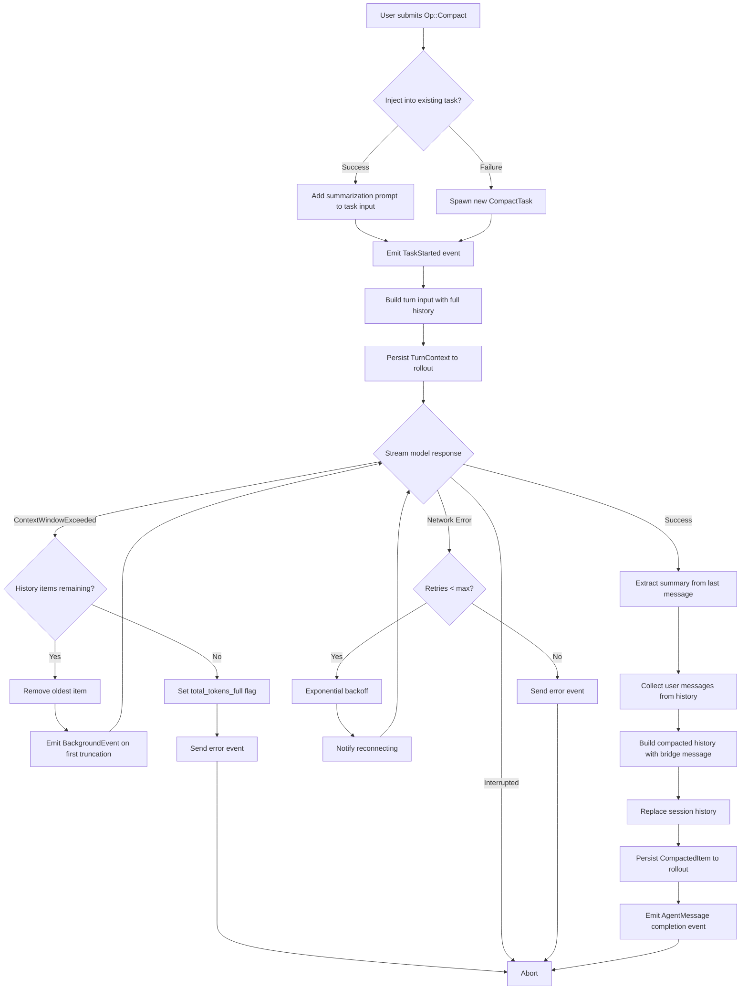
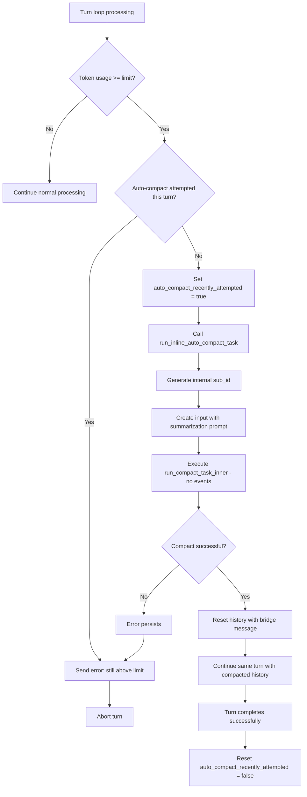
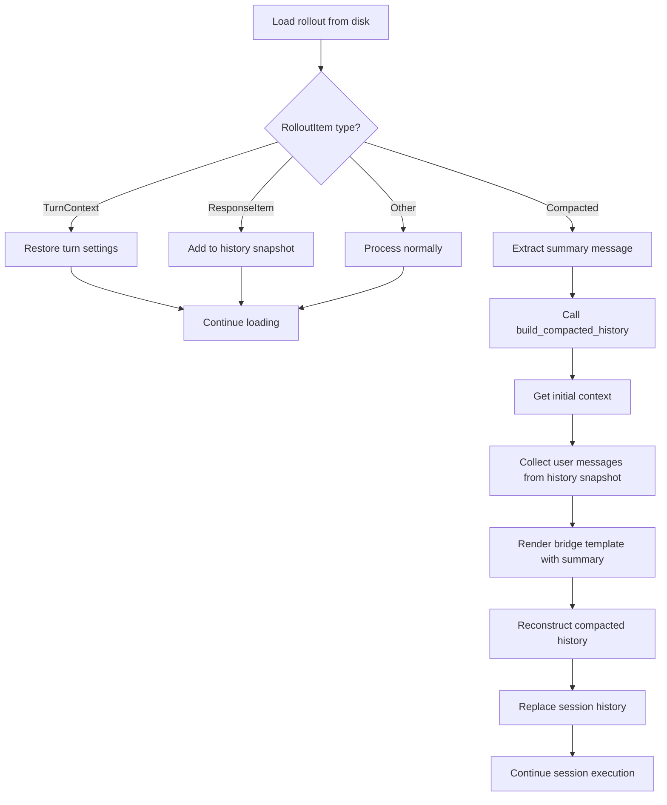

# Compact Command - Complete Reference

**Version**: 1.0
**Last Updated**: 2025-10-19
**Component**: Codex-RS Core

---

## Table of Contents

1. [Overview](#overview)
2. [Architecture](#architecture)
3. [Operation Modes](#operation-modes)
4. [Implementation Details](#implementation-details)
5. [Configuration](#configuration)
6. [Logic Flow](#logic-flow)
7. [Error Handling](#error-handling)
8. [Edge Cases & Nuances](#edge-cases--nuances)
9. [Testing Coverage](#testing-coverage)
10. [Performance Characteristics](#performance-characteristics)
11. [File Reference](#file-reference)

---

## Overview

### Purpose

The **compact command** is a sophisticated conversation history management system that prevents context window overflow by summarizing long conversations. When token usage approaches model limits, compact creates a condensed representation of the conversation history while preserving critical information for task continuity.

### Key Features

- **Dual-mode operation**: Manual user-initiated and automatic threshold-based activation
- **Intelligent summarization**: AI-generated summaries preserve task context and progress
- **Robust error recovery**: Progressive history truncation with retry logic
- **Session persistence**: Full rollout tracking for resume/fork workflows
- **Transparent operation**: Auto-compact happens inline without user interruption

### Use Cases

1. **Long-running sessions** with extensive back-and-forth conversations
2. **Complex multi-turn tasks** approaching token limits
3. **Session resume/fork** workflows requiring history reconstruction
4. **Context window management** for different model variants

---

## Architecture

### Component Hierarchy

```
Op::Compact (Protocol Layer)
    ↓
CompactTask (Task Layer)
    ↓
run_compact_task_inner() (Core Implementation)
    ↓
├── drain_to_completed() → Stream model response
├── build_compacted_history() → Reconstruct conversation
└── Session persistence → Rollout tracking
```

### Key Components

| Component | File | Responsibility |
|-----------|------|----------------|
| `Op::Compact` | `protocol/src/protocol.rs:174` | Protocol-level operation definition |
| `CompactTask` | `core/src/tasks/compact.rs` | Task trait implementation |
| `TaskKind::Compact` | `core/src/state/turn.rs:32-47` | Task classification and HTTP header |
| `run_compact_task_inner()` | `core/src/codex/compact.rs:67-178` | Core execution logic |
| `build_compacted_history()` | `core/src/codex/compact.rs:219-254` | History reconstruction algorithm |
| Auto-compact trigger | `core/src/codex.rs:1773-1909` | Token limit detection |

### Data Flow

```
User Request / Auto-Trigger
    ↓
[Check token limit] → Auto-compact path (inline)
    ↓
[Create/Inject input with summarization prompt]
    ↓
[Build turn history with full context]
    ↓
[Stream model response with TaskKind::Compact header]
    ↓
[Extract summary from assistant message]
    ↓
[Collect user messages, filter session prefixes]
    ↓
[Build bridge message (user messages + AI summary)]
    ↓
[Replace session history with compacted version]
    ↓
[Persist CompactedItem to rollout]
    ↓
[Emit completion event (manual) or continue turn (auto)]
```

---

## Operation Modes

### Manual Compact

**Trigger**: User submits `Op::Compact` operation

**Behavior**:
```rust
// core/src/codex.rs:1479-1491
Op::Compact => {
    let turn_context = sess.new_turn(SessionSettingsUpdate::default()).await;

    // Attempt to inject into existing task
    if let Err(items) = sess
        .inject_input(vec![InputItem::Text {
            text: compact::SUMMARIZATION_PROMPT.to_string(),
        }])
        .await
    {
        // Spawn new CompactTask if injection fails
        sess.spawn_task(Arc::clone(&turn_context), sub.id, items, CompactTask)
            .await;
    }
}
```

**Event Lifecycle**:
1. `TaskStarted` event emitted
2. `BackgroundEvent` (if truncation occurred during retry)
3. `AgentMessage` with "Compact task completed" message
4. `TaskComplete` event

**User Experience**: Visible task execution with feedback events

### Automatic Compact

**Trigger**: Token usage exceeds `model_auto_compact_token_limit`

**Detection Logic**:
```rust
// core/src/codex.rs:1773-1909
let limit = turn_context.client.get_auto_compact_token_limit()
    .unwrap_or(i64::MAX);
let total_usage_tokens = total_token_usage
    .as_ref()
    .map(TokenUsage::tokens_in_context_window);
let token_limit_reached = total_usage_tokens
    .map(|tokens| (tokens as i64) >= limit)
    .unwrap_or(false);

if token_limit_reached {
    if auto_compact_recently_attempted {
        // Error: Still above limit after compaction
        return error_event;
    }
    auto_compact_recently_attempted = true;
    compact::run_inline_auto_compact_task(sess.clone(), turn_context.clone()).await;
    continue;  // Retry the same turn with compacted history
}
```

**Implementation**:
```rust
// core/src/codex/compact.rs:39-48
pub(crate) async fn run_inline_auto_compact_task(
    sess: Arc<Session>,
    turn_context: Arc<TurnContext>,
) {
    let sub_id = sess.next_internal_sub_id();
    let input = vec![InputItem::Text {
        text: SUMMARIZATION_PROMPT.to_string(),
    }];
    run_compact_task_inner(sess, turn_context, sub_id, input).await;
}
```

**Key Differences from Manual**:
- No `TaskStarted` event emitted
- Uses internal sub_id for tracking
- Executes synchronously within turn loop
- User sees only final turn result (no intermediate feedback)

**Safety Mechanism**: Maximum **one auto-compact attempt per turn** to prevent infinite loops

---

## Implementation Details

### Core Execution Loop

**Function**: `run_compact_task_inner()` (`core/src/codex/compact.rs:67-178`)

#### Phase 1: Setup (Lines 73-90)

```rust
// Build input from request
let initial_input_for_turn = ResponseInputItem::from_input_items(
    turn_context.as_ref(),
    input,
    Instant::now(),
);

// Get full conversation history
let mut turn_input = sess
    .turn_input_with_history(vec![initial_input_for_turn.clone().into()])
    .await;

// Persist turn context to rollout
let rollout_item = RolloutItem::TurnContext(TurnContextItem {
    cwd: turn_context.cwd.clone(),
    approval_policy: turn_context.approval_policy,
    sandbox_policy: turn_context.sandbox_policy.clone(),
    model: turn_context.client.get_model(),
    effort: turn_context.client.get_reasoning_effort(),
    summary: turn_context.client.get_reasoning_summary(),
});
sess.persist_rollout_items(&[rollout_item]).await;
```

**Purpose**: Construct complete turn input with full history and persist context snapshot

#### Phase 2: Retry Loop with Progressive Truncation (Lines 92-157)

```rust
let max_retries = 3;
let mut retries = 0;
let mut truncated_count = 0;

loop {
    // Build prompt from current turn input
    let prompt = sess.build_prompt(
        turn_context.clone(),
        turn_input.clone(),
        ResumeFrom::default(),
    ).await;

    // Stream response from model with TaskKind::Compact header
    match drain_to_completed(sess.clone(), turn_context.clone(), prompt, &sub_id).await {
        Ok(output) => break output,  // Success!

        Err(CodexErr::ContextWindowExceeded) => {
            if turn_input.len() > 1 {
                turn_input.remove(0);  // Remove oldest history item
                truncated_count += 1;
                retries = 0;  // Reset retry counter

                // Notify user (manual compact only)
                if truncated_count == 1 {
                    sess.send_event(Event {
                        id: sub_id.clone(),
                        kind: EventKind::BackgroundEvent,
                        message: "Conversation history too long...".to_string(),
                    }).await;
                }
                continue;
            }
            // Cannot truncate further → fatal error
            sess.set_total_tokens_full(&sub_id, turn_context.as_ref()).await;
            return;
        }

        Err(CodexErr::Interrupted) => {
            // User interrupted → abort immediately
            return;
        }

        Err(e) => {
            if retries < max_retries {
                retries += 1;
                let delay = backoff(retries);
                sess.notify_stream_error(
                    &sub_id,
                    format!("Re-connecting... {retries}/{max_retries}")
                ).await;
                tokio::time::sleep(delay).await;
                continue;
            }
            // Max retries exceeded → error event
            sess.send_event_error(
                sub_id.clone(),
                format!("Failed to compact: {e}")
            ).await;
            return;
        }
    }
}
```

**Error Handling Strategy**:

| Error Type | Action | Retry Behavior |
|------------|--------|----------------|
| `ContextWindowExceeded` | Remove oldest history item | Reset retry counter, continue with smaller input |
| Network/Stream errors | Exponential backoff | Max 3 retries with delay |
| `Interrupted` | Abort immediately | No retry |
| Unrecoverable | Send error event | Terminate task |

#### Phase 3: History Reconstruction (Lines 159-177)

```rust
// Extract AI-generated summary from last assistant message
let summary_text = content_items_to_text(
    &output.messages.last()
        .and_then(|m| m.as_output())
        .map(|o| &o.content[..])
        .unwrap_or(&[])
);

// Collect all user messages (excluding session prefixes)
let history_snapshot = sess.history_snapshot().await;
let user_messages = collect_user_messages(&history_snapshot);

// Build new history with bridge message
let initial_context = sess.build_initial_context(turn_context.as_ref());
let new_history = build_compacted_history(
    initial_context,
    &user_messages,
    &summary_text.unwrap_or("(no summary available)".to_string()),
);

// Replace entire conversation history
sess.replace_history(new_history).await;

// Persist compaction record to rollout
let rollout_item = RolloutItem::Compacted(CompactedItem {
    message: summary_text.unwrap_or_default(),
});
sess.persist_rollout_items(&[rollout_item]).await;

// Emit completion event (manual compact only)
sess.send_event(Event {
    id: sub_id.clone(),
    kind: EventKind::AgentMessage,
    message: "Compact task completed successfully".to_string(),
}).await;
```

**Output**: New conversation history with single bridge message replacing all previous turns

### History Reconstruction Algorithm

**Function**: `build_compacted_history()` (`core/src/codex/compact.rs:219-254`)

```rust
pub fn build_compacted_history(
    mut initial_context: Vec<InputMessage>,
    user_messages: &[String],
    summary_text: &str,
) -> Vec<InputMessage> {
    // Step 1: Start with system instructions and environment context
    let mut new_history = initial_context;

    // Step 2: Collect all user messages text
    let user_messages_text = if user_messages.is_empty() {
        "(none)".to_string()
    } else {
        user_messages.join("\n")
    };

    // Step 3: Truncate if too long (>80KB ≈ 20K tokens)
    let user_messages_text = if user_messages_text.len() > COMPACT_USER_MESSAGE_MAX_TOKENS * 4 {
        truncate_middle(&user_messages_text, COMPACT_USER_MESSAGE_MAX_TOKENS * 4)
    } else {
        user_messages_text
    };

    // Step 4: Build bridge message from template
    let bridge_text = HistoryBridgeTemplate {
        user_messages_text: &user_messages_text,
        summary_text: if summary_text.is_empty() {
            "(no summary available)"
        } else {
            summary_text
        },
    }
    .render()
    .expect("Failed to render history bridge template");

    // Step 5: Append bridge message as user message
    new_history.push(InputMessage::new_user(vec![InputContent::Text(
        InputText {
            text: bridge_text,
            kind: InputMessageKind::Normal,
        },
    )]));

    new_history
}
```

**Algorithm Steps**:

1. **Preserve Initial Context**: Keep system instructions, environment context
2. **Collect User Messages**: Extract all user-provided text (filter session prefixes)
3. **Truncate if Needed**: Max 80,000 bytes (~20K tokens) with middle truncation
4. **Render Bridge Template**: Insert user messages + AI summary into template
5. **Construct New History**: Initial context + single bridge message

**Bridge Message Template** (`core/templates/compact/history_bridge.md`):
```markdown
You were originally given instructions from a user over one or more turns. Here were the user messages:

{{ user_messages_text }}

Another language model started to solve this problem and produced a summary of its thinking process. You also have access to the state of the tools that were used by that language model. Use this to build on the work that has already been done and avoid duplicating work. Here is the summary produced by the other language model, use the information in this summary to assist with your analysis:

{{ summary_text }}
```

### User Message Collection

**Function**: `collect_user_messages()` (`core/src/codex/compact.rs:199-210`)

```rust
fn collect_user_messages(history: &[InputMessage]) -> Vec<String> {
    history
        .iter()
        .filter(|msg| {
            msg.role == Role::User && !is_session_prefix_message(msg)
        })
        .filter_map(|msg| {
            content_items_to_text(&msg.content)
        })
        .collect()
}
```

**Filtering Logic**:
- **Include**: `Role::User` messages only
- **Exclude**: Session prefix messages (`<user_instructions>`, `<ENVIRONMENT_CONTEXT>`)
- **Exclude**: Assistant messages
- **Ignore**: Image-only content

**Session Prefix Detection**:
```rust
fn is_session_prefix_message(msg: &InputMessage) -> bool {
    msg.content.iter().any(|c| {
        if let InputContent::Text(text) = c {
            matches!(
                text.kind,
                InputMessageKind::UserInstructions | InputMessageKind::EnvironmentContext
            )
        } else {
            false
        }
    })
}
```

### Content Extraction

**Function**: `content_items_to_text()` (`core/src/codex/compact.rs:180-197`)

```rust
fn content_items_to_text(content: &[impl AsRef<dyn Content>]) -> Option<String> {
    let texts: Vec<_> = content
        .iter()
        .filter_map(|item| match item.as_ref() {
            Content::InputText(t) => Some(&t.text),
            Content::OutputText(t) => Some(&t.text),
            Content::Image(_) => None,  // Skip images
            // ... other variants
        })
        .filter(|s| !s.is_empty())
        .collect();

    if texts.is_empty() {
        None
    } else {
        Some(texts.into_iter().cloned().collect::<Vec<_>>().join("\n"))
    }
}
```

**Behavior**:
- Combines `InputText` and `OutputText` items
- Filters out empty strings
- Joins with newlines
- Returns `None` for image-only content

### Model Streaming

**Function**: `drain_to_completed()` (`core/src/codex/compact.rs:256-291`)

```rust
async fn drain_to_completed(
    sess: Arc<Session>,
    turn_context: Arc<TurnContext>,
    prompt: Prompt,
    sub_id: &str,
) -> Result<OutputState> {
    // Send request with TaskKind::Compact header
    let mut stream = turn_context
        .client
        .clone()
        .stream_with_task_kind(prompt, TaskKind::Compact)
        .await?;

    let start_time = Instant::now();
    let mut output_state = OutputState::default();

    // Stream response events
    while let Some(event) = stream.next().await {
        let event = event?;

        // Update output state
        output_state.update(&event)?;

        // Send event to user (manual compact shows streaming, auto hides it)
        sess.send_event(Event {
            id: sub_id.to_string(),
            kind: event.kind,
            message: event.message,
        }).await;
    }

    Ok(output_state)
}
```

**HTTP Header**: `Codex-Task-Type: compact` (set via `TaskKind::Compact`)

**Output**: Complete `OutputState` with assistant messages

---

## Configuration

### Token Limit Settings

**Config Field**: `model_auto_compact_token_limit` (`core/src/config.rs:92`)

```rust
/// Token usage threshold triggering auto-compaction of conversation history.
/// If None, uses model-specific default from `openai_model_info.rs`.
pub model_auto_compact_token_limit: Option<i64>,
```

**Default Values** (`core/src/openai_model_info.rs`):
```rust
// GPT-5 models
auto_compact_token_limit: Some(350_000),

// Other models
auto_compact_token_limit: None,  // Disabled by default
```

**Retrieval Logic** (`core/src/client.rs:121-125`):
```rust
pub fn get_auto_compact_token_limit(&self) -> Option<i64> {
    self.config.model_auto_compact_token_limit.or_else(|| {
        get_model_info(&self.config.model_family)
            .and_then(|info| info.auto_compact_token_limit)
    })
}
```

**Priority**: Explicit config value > model-specific default > disabled

### Summarization Prompt

**Template**: `core/templates/compact/prompt.md`

```markdown
You have exceeded the maximum number of tokens, please stop coding and instead write a short memento message for the next agent. Your note should:
- Summarize what you finished and what still needs work. If there was a recent update_plan call, repeat its steps verbatim.
- List outstanding TODOs with file paths / line numbers so they're easy to find.
- Flag code that needs more tests (edge cases, performance, integration, etc.).
- Record any open bugs, quirks, or setup steps that will make it easier for the next agent to pick up where you left off.
```

**Purpose**: Guides AI to produce actionable summary focusing on:
- Work completed vs. remaining
- Concrete TODOs with file locations
- Testing gaps
- Known issues and setup requirements

### Truncation Parameters

**Constant**: `COMPACT_USER_MESSAGE_MAX_TOKENS = 20_000` (`compact.rs:30`)

**Byte Conversion**: 20,000 tokens × 4 bytes/token = 80,000 bytes

**Truncation Method**: Middle truncation with `[tokens truncated]` marker

**Example**:
```
Original: <first 40KB of text> ... <middle 120KB> ... <last 40KB>
After:    <first 40KB of text> [tokens truncated] <last 40KB>
```

---

## Logic Flow

### Manual Compact Flow



### Auto-Compact Flow



### Resume/Fork Session Flow



---

## Error Handling

### Context Window Overflow Recovery

**Location**: `compact.rs:116-132`

**Strategy**: Progressive history truncation with retry

```rust
Err(CodexErr::ContextWindowExceeded) => {
    if turn_input.len() > 1 {
        // Remove oldest conversation item
        turn_input.remove(0);
        truncated_count += 1;
        retries = 0;  // Reset retry counter for new attempt

        // Notify user on first truncation (manual compact only)
        if truncated_count == 1 {
            sess.send_event(Event {
                kind: EventKind::BackgroundEvent,
                message: "Conversation history too long, removing older messages...".to_string(),
            }).await;
        }
        continue;  // Retry with smaller input
    }

    // No more items to remove → fatal error
    sess.set_total_tokens_full(&sub_id, turn_context.as_ref()).await;
    sess.send_event(Event {
        kind: EventKind::Error,
        message: "Cannot compact: conversation still exceeds context window".to_string(),
    }).await;
    return;
}
```

**Behavior**:
- Removes one history item per iteration
- Resets retry counter (allows 3 fresh attempts with smaller input)
- Emits `BackgroundEvent` on first truncation
- Aborts if no items remain and still exceeds limit

### Stream Connection Errors

**Location**: `compact.rs:135-144`

**Strategy**: Exponential backoff with max retries

```rust
Err(e) => {
    if retries < max_retries {
        retries += 1;
        let delay = backoff(retries);  // Exponential: 2^retries seconds

        sess.notify_stream_error(
            &sub_id,
            format!("Connection lost. Re-connecting... {retries}/{max_retries}")
        ).await;

        tokio::time::sleep(delay).await;
        continue;
    }

    // Max retries exceeded
    sess.send_event_error(
        sub_id.clone(),
        format!("Failed to complete compact after {max_retries} retries: {e}")
    ).await;
    return;
}
```

**Backoff Schedule**:
- Retry 1: ~2 seconds
- Retry 2: ~4 seconds
- Retry 3: ~8 seconds

### Interruption Handling

**Location**: `compact.rs:133-134`

```rust
Err(CodexErr::Interrupted) => {
    // User cancelled operation → abort immediately
    return;
}
```

**Behavior**: Immediate clean termination, no error event

### Auto-Compact Failure Protection

**Location**: `codex.rs:1888-1904`

**Problem**: Prevent infinite compaction loops if auto-compact fails to reduce tokens sufficiently

**Solution**: Single-attempt flag per turn

```rust
if token_limit_reached {
    if auto_compact_recently_attempted {
        // Already tried compaction this turn → abort with error
        sess.send_event(Event {
            kind: EventKind::Error,
            message: "Token limit still exceeded after auto-compact. Please manually compact or reduce conversation scope.".to_string(),
        }).await;
        return;
    }

    auto_compact_recently_attempted = true;
    compact::run_inline_auto_compact_task(sess.clone(), turn_context.clone()).await;
    continue;  // Retry turn
}
```

**Reset Condition**: Flag cleared on successful turn completion (line 1909)

---

## Edge Cases & Nuances

### Empty/Missing Summary Handling

**Scenario**: Model fails to produce summary or returns empty response

**Implementation**: `build_compacted_history()` lines 236-240

```rust
let summary_text = if summary_text.is_empty() {
    "(no summary available)".to_string()
} else {
    summary_text.to_string()
};
```

**Result**: Bridge message includes placeholder text, operation continues

### Session Prefix Message Filtering

**Problem**: System messages regenerated each turn should not be included in user message collection

**Detection**: `is_session_prefix_message()` checks `InputMessageKind`:

```rust
fn is_session_prefix_message(msg: &InputMessage) -> bool {
    msg.content.iter().any(|c| {
        if let InputContent::Text(text) = c {
            matches!(
                text.kind,
                InputMessageKind::UserInstructions |
                InputMessageKind::EnvironmentContext
            )
        } else {
            false
        }
    })
}
```

**Filtered Blocks**:
- `<user_instructions>...</user_instructions>`
- `<ENVIRONMENT_CONTEXT>...</ENVIRONMENT_CONTEXT>`

**Rationale**: These blocks are rebuilt from config each turn, including them would cause duplication

### Image Content Handling

**Implementation**: `content_items_to_text()` lines 185-186

```rust
Content::Image(_) => None,  // Skip image content
```

**Behavior**:
- Images ignored during text extraction
- If message contains only images → returns `None`
- Mixed text+images → extracts text only

**Limitation**: Image context lost during compaction (no image summarization)

### Bridge Message Truncation

**Scenario**: User messages exceed 80KB (~20K tokens)

**Implementation**: `build_compacted_history()` lines 231-234

```rust
let user_messages_text = if user_messages_text.len() > COMPACT_USER_MESSAGE_MAX_TOKENS * 4 {
    truncate_middle(&user_messages_text, COMPACT_USER_MESSAGE_MAX_TOKENS * 4)
} else {
    user_messages_text
};
```

**Truncation Method**: Middle truncation (preserves start and end)

**Output Example**:
```
<first 40KB of messages>
[tokens truncated]
<last 40KB of messages>
```

**Rationale**: Preserves early context (original instructions) and recent context (current work)

### Multiple Compactions in Same Session

**Scenario**: Session compacts, continues, hits limit again

**Behavior**: Second compact uses **first compact's summary**

**Implementation**: When loading rollout during second compact:

```rust
// Previous CompactedItem persisted in rollout
RolloutItem::Compacted(compacted) => {
    let rebuilt = build_compacted_history(
        initial_context,
        &collect_user_messages(&history_snapshot),
        &compacted.message,  // ← Reuses first summary
    );
}
```

**Result**: Bridge message includes:
- All user messages since first compact
- Original AI summary from first compact

**Design Choice**: Avoids exponential summary degradation (summary of summary of summary...)

### Inline Auto-Compact Transparency

**Behavior**: Auto-compact executes without user-visible events

**Implementation Differences**:

| Aspect | Manual Compact | Auto-Compact |
|--------|----------------|--------------|
| TaskStarted event | ✅ Emitted | ❌ Silent |
| Sub-ID type | User-facing | Internal (`next_internal_sub_id()`) |
| Streaming visibility | ✅ Visible | ❌ Hidden |
| Completion message | ✅ "Compact task completed" | ❌ Silent |
| User experience | Explicit task execution | Transparent retry |

**Rationale**: User requested an operation, not a compaction → show only the requested operation result

### Retry Counter Interaction

**Nuance**: Context window errors reset retry counter

**Code**: `compact.rs:119`

```rust
Err(CodexErr::ContextWindowExceeded) => {
    if turn_input.len() > 1 {
        turn_input.remove(0);
        truncated_count += 1;
        retries = 0;  // ← Reset allows 3 fresh attempts with new input size
        continue;
    }
}
```

**Scenario**:
1. Initial attempt: context window exceeded
2. Remove 1 history item
3. Network error on retry → exponential backoff attempt 1
4. Network error again → exponential backoff attempt 2
5. Context window exceeded again → remove another item, **reset retries to 0**
6. Network error → fresh exponential backoff attempt 1 (not 3)

**Design Choice**: Ensures robustness against combined truncation + transient network issues

---

## Testing Coverage

### Unit Tests

**File**: `core/src/codex/compact.rs:293-422`

| Test Name | Purpose | Key Assertions |
|-----------|---------|----------------|
| `content_items_to_text_joins_non_empty_segments` | Content extraction correctness | Empty strings filtered, non-empty joined with `\n` |
| `content_items_to_text_ignores_image_only_content` | Image handling | Image-only messages return `None` |
| `collect_user_messages_extracts_user_text_only` | Message filtering | Only user messages extracted, assistant filtered |
| `collect_user_messages_filters_session_prefix_entries` | Session prefix filtering | `<user_instructions>` and `<ENVIRONMENT_CONTEXT>` excluded |
| `build_compacted_history_truncates_overlong_user_messages` | Bridge truncation | 200KB messages truncated to 80KB with `[tokens truncated]` marker |

**Example Test**:
```rust
#[test]
fn build_compacted_history_truncates_overlong_user_messages() {
    let user_messages = vec!["x".repeat(200_000)];  // 200KB message
    let result = build_compacted_history(
        vec![],
        &user_messages,
        "test summary",
    );

    let bridge_text = result[0].content[0].as_text().unwrap();
    assert!(bridge_text.len() < 100_000);  // Should be truncated
    assert!(bridge_text.contains("[tokens truncated]"));  // Marker present
}
```

### Integration Tests

**File**: `core/tests/suite/compact.rs` (947 lines)

#### Test 1: `summarize_context_three_requests_and_instructions`

**Lines**: 48-260

**Scenario**: Full manual compact workflow

**Flow**:
1. User sends initial request
2. Assistant responds
3. User sends follow-up
4. User triggers `Op::Compact`
5. Verify summarization prompt injected
6. Verify bridge message format
7. Verify rollout entries

**Assertions**:
```rust
// Verify compact task execution
assert_eq!(events[5].kind, EventKind::TaskStarted);
assert_eq!(events[6].kind, EventKind::AgentMessage);

// Verify model sees bridge message
assert!(model_input.contains("You were originally given instructions"));
assert!(model_input.contains("Here is the summary produced"));

// Verify rollout contains TurnContext + Compacted
assert!(matches!(rollout_items[n], RolloutItem::TurnContext(_)));
assert!(matches!(rollout_items[n+1], RolloutItem::Compacted(_)));
```

#### Test 2: `auto_compact_runs_after_token_limit_hit`

**Lines**: 265-407

**Scenario**: Auto-compact triggered by token limit

**Flow**:
1. Configure `model_auto_compact_token_limit = 100`
2. Send requests that accumulate tokens
3. Second request triggers auto-compact
4. Verify inline execution (no user events)
5. Verify summarization prompt auto-injected
6. Verify third request to model after compaction

**Assertions**:
```rust
// First request: normal execution
assert_eq!(model_requests[0].messages.len(), 3);  // System + env + user

// Auto-compact triggered (internal, no event)
assert_eq!(model_requests[1].messages.last().content, SUMMARIZATION_PROMPT);

// Third request: compacted history
assert_eq!(model_requests[2].messages.len(), 3);  // System + env + bridge
assert!(model_requests[2].messages[2].content.contains("You were originally given"));
```

#### Test 3: `auto_compact_persists_rollout_entries`

**Lines**: 410-520

**Scenario**: Rollout file validation after auto-compact

**Assertions**:
```rust
let rollout_items = load_rollout(&session_dir);

// Verify TurnContext entries
let turn_context_count = rollout_items
    .iter()
    .filter(|i| matches!(i, RolloutItem::TurnContext(_)))
    .count();
assert_eq!(turn_context_count, expected_count);

// Verify Compacted entry exists
assert!(rollout_items.iter().any(|i| matches!(i, RolloutItem::Compacted(_))));
```

#### Test 4: `auto_compact_stops_after_failed_attempt`

**Lines**: 523-626

**Scenario**: Second turn still exceeds limit after first auto-compact

**Flow**:
1. First turn triggers auto-compact → succeeds
2. Second turn still exceeds limit
3. Auto-compact attempted flag already true
4. Error event emitted

**Assertions**:
```rust
// First turn: auto-compact succeeds
assert_eq!(model_requests.len(), 2);  // Original + compact

// Second turn: error because still above limit
let error_event = events.iter().find(|e| e.kind == EventKind::Error);
assert!(error_event.message.contains("still exceeded after auto-compact"));

// No additional model requests (no infinite loop)
assert_eq!(model_requests.len(), 2);
```

#### Test 5: `manual_compact_retries_after_context_window_error`

**Lines**: 629-750

**Scenario**: Compact task fails with context window error, retries with truncation

**Flow**:
1. Mock model to return `ContextWindowExceeded` on first attempt
2. User triggers manual compact
3. Verify first attempt fails
4. Verify second attempt succeeds with fewer history items
5. Verify background event notification

**Assertions**:
```rust
// First model call: full history
assert_eq!(model_requests[0].messages.len(), 5);  // System + env + 3 history items

// Background event emitted
let bg_event = events.iter().find(|e| e.kind == EventKind::BackgroundEvent);
assert!(bg_event.message.contains("history too long"));

// Second model call: truncated history
assert_eq!(model_requests[1].messages.len(), 4);  // System + env + 2 history items (oldest removed)
```

#### Test 6: `auto_compact_allows_multiple_attempts_when_interleaved_with_other_turn_events`

**Lines**: 753-862

**Scenario**: Two auto-compacts allowed across different turns

**Flow**:
1. First turn exceeds limit → auto-compact
2. Function call output received (turn boundary)
3. Second turn exceeds limit → second auto-compact allowed
4. Verify flag reset between turns

**Assertions**:
```rust
// First auto-compact
assert_eq!(model_requests[1].content, SUMMARIZATION_PROMPT);

// Function output received (turn boundary)
submit_function_output(&session, ...);

// Second auto-compact allowed (flag reset)
assert_eq!(model_requests[3].content, SUMMARIZATION_PROMPT);

// Both compacts succeed
assert_eq!(compacted_items_count, 2);
```

### Resume/Fork Tests

**File**: `core/tests/suite/compact_resume_fork.rs` (840 lines)

#### Test 1: `compact_resume_and_fork_preserve_model_history_view`

**Lines**: 48-499

**Scenario**: Full lifecycle: compact → resume → fork

**Flow**:
1. Initial session with 3 turns
2. Manual compact
3. Resume session from rollout
4. Verify model sees bridge message
5. Fork session
6. Verify fork preserves compacted history

**Assertions**:
```rust
// Original session: verify compact
let compacted_item = rollout_items
    .iter()
    .find_map(|i| match i {
        RolloutItem::Compacted(c) => Some(c),
        _ => None,
    })
    .unwrap();

// Resumed session: verify bridge message
let resumed_history = get_model_input(&resumed_session);
assert!(resumed_history.contains("You were originally given"));
assert!(resumed_history.contains(&compacted_item.message));

// Forked session: verify same history
let forked_history = get_model_input(&forked_session);
assert_eq!(resumed_history, forked_history);
```

#### Test 2: `compact_resume_after_second_compaction_preserves_history`

**Lines**: 504-645

**Scenario**: Fork → compact fork → resume forked branch

**Flow**:
1. Original session with compact
2. Fork and add more turns
3. Second compact in forked session
4. Resume forked session
5. Verify second compact includes first summary

**Assertions**:
```rust
// First compact summary
let first_summary = get_first_compacted_message(&rollout);

// Second compact in fork
fork_and_compact(&session);
let second_compact_input = get_model_input(&forked_session);

// Verify first summary reused in second compact
assert!(second_compact_input.contains(&first_summary));
assert!(second_compact_input.contains("You were originally given"));
```

---

## Performance Characteristics

### Token Budgets

| Component | Token Estimate | Bytes (approx) |
|-----------|----------------|----------------|
| Summarization prompt | ~100 | 400 |
| User messages (max) | 20,000 | 80,000 |
| AI summary | Variable | 1,000-5,000 |
| Bridge template overhead | ~50 | 200 |
| **Total bridge message** | **~20,200** | **~81,000** |

### Processing Overhead

**Auto-Compact Latency**:
- History reconstruction: <100ms
- Model summarization: 5-30s (depends on model)
- Bridge message rendering: <10ms
- Session history replacement: <50ms

**Manual Compact Latency**:
- Same as auto-compact + event emission overhead (~50ms)

### Retry Performance

**Context Window Errors**:
- Progressive truncation: ~100ms per iteration
- Max iterations: `turn_input.len()` (typically 3-10)

**Network Errors**:
- Backoff delays: 2s, 4s, 8s (total ~14s max)
- Max retries: 3

### Memory Impact

**Before Compact**:
- Full conversation history: Variable (can exceed 100KB)
- All messages retained in memory

**After Compact**:
- Single bridge message: ~80KB max
- Memory reduction: 50-90% depending on conversation length

---

## File Reference

### Core Implementation

| File | Lines | Key Functions/Types |
|------|-------|---------------------|
| `core/src/codex/compact.rs` | 422 | `run_compact_task()`, `run_compact_task_inner()`, `build_compacted_history()`, `collect_user_messages()`, `content_items_to_text()`, `drain_to_completed()` |
| `core/src/tasks/compact.rs` | 34 | `CompactTask` struct, `SessionTask` trait impl |
| `core/src/state/turn.rs` | 134 | `TaskKind::Compact` enum variant, `header_value()` |
| `protocol/src/protocol.rs` | 1433+ | `Op::Compact`, `CompactedItem`, `RolloutItem::Compacted` |

### Orchestration

| File | Lines | Key Functions/Types |
|------|-------|---------------------|
| `core/src/codex.rs` | 1962+ | Manual compact dispatch (1479-1491), auto-compact trigger (1773-1909) |
| `core/src/config.rs` | 150+ | `model_auto_compact_token_limit` field |
| `core/src/client.rs` | 1448+ | `get_auto_compact_token_limit()`, `stream_with_task_kind()` |

### Model Configuration

| File | Purpose |
|------|---------|
| `core/src/openai_model_info.rs` | Default token limits per model (350K for GPT-5) |

### Templates

| File | Purpose |
|------|---------|
| `core/templates/compact/prompt.md` | Summarization instruction prompt |
| `core/templates/compact/history_bridge.md` | Bridge message template (user messages + AI summary) |

### Tests

| File | Lines | Test Count |
|------|-------|------------|
| `core/tests/suite/compact.rs` | 947 | 6 integration tests |
| `core/tests/suite/compact_resume_fork.rs` | 840 | 2 resume/fork tests |
| `core/src/codex/compact.rs` (unit tests) | 130 | 5 unit tests |

---

## Appendix: Example Scenarios

### Scenario 1: Normal Auto-Compact

**Initial State**:
```
Token usage: 345,000 / 350,000 limit
History: 15 messages (system + 7 user + 7 assistant)
```

**Trigger**: 16th message would exceed limit

**Auto-Compact Process**:
1. Detect token limit reached
2. Set `auto_compact_recently_attempted = true`
3. Generate internal sub_id: `internal_001`
4. Inject summarization prompt
5. Call model with full history + prompt
6. Model returns summary: "User requested feature X. Implemented API endpoints. TODO: Add tests for edge cases."
7. Collect user messages: 7 messages, 5KB total
8. Build bridge message with user messages + summary
9. Replace history: system + env + bridge (3 messages total)
10. Retry original turn with compacted history
11. Turn succeeds, reset flag

**Final State**:
```
Token usage: 85,000 / 350,000 limit
History: 3 messages (system + env + bridge)
Next turn: proceeds normally
```

### Scenario 2: Context Window Error During Compact

**Initial State**:
```
Compact task started
History: system + env + 10 conversation messages
```

**Error Flow**:
1. First attempt: all 12 messages sent to model
2. Model returns: `ContextWindowExceeded`
3. Remove oldest conversation message (now 11 messages)
4. Emit background event: "Conversation history too long..."
5. Retry with 11 messages
6. Success: summary generated
7. Build bridge message
8. Replace history

**Final State**:
```
History: system + env + bridge (oldest message excluded from user_messages)
Compact succeeded with truncation
```

### Scenario 3: Auto-Compact Failure

**Initial State**:
```
Token usage: 355,000 / 350,000 limit
auto_compact_recently_attempted = false
```

**Flow**:
1. Detect token limit exceeded
2. Run inline auto-compact
3. Compaction completes successfully
4. Retry turn with compacted history
5. Turn **still** exceeds limit (compaction insufficient)
6. Detect: `auto_compact_recently_attempted = true`
7. Emit error event: "Token limit still exceeded after auto-compact"
8. Abort turn

**User Action Required**: Manual compact or reduce scope

### Scenario 4: Multiple Compactions in Session

**Timeline**:

**T1**: Initial session
```
Messages: 20 user/assistant pairs
Token usage: 300K
```

**T2**: First compact
```
Action: Manual compact triggered
Result: Bridge message with all 20 user messages + summary A
History: system + env + bridge
```

**T3**: Continue working
```
Messages: Bridge + 15 new user/assistant pairs
Token usage: 340K
```

**T4**: Second compact
```
Action: Auto-compact triggered
Input: Bridge message + 15 new messages
Summary: Model sees bridge (which includes summary A) + new messages
Result: New bridge with:
  - Original 20 user messages (from bridge)
  - New 15 user messages
  - Summary A (from first compact)
History: system + env + new_bridge
```

**Key Insight**: Summary from first compact is preserved, not re-summarized

---

## Revision History

| Version | Date | Changes |
|---------|------|---------|
| 1.0 | 2025-10-19 | Initial comprehensive documentation |

---

**Maintained by**: Codex-RS Core Team
**Contact**: See repository issues for questions or improvements